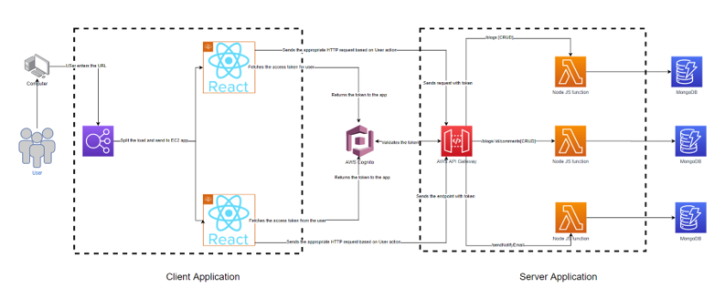

# CSCI5409 Project
This repository contains the back end code of the Blog management application built using Node, Express, and dynamoose(Document DB).

The code is deployed in the AWS Lambda instances as shown in the proposed cloud architecture design. The endpoints are exposed to the frontend with the help of API Gateway service.
The Users consuming this resources are authenticated with the help of AWS Cognito.

This project is guided by [Dr Jaume Manero](https://www.dal.ca/faculty/computerscience/faculty-staff.html).
A simple demo explanation on the architecture design and web application -  [Demo](https://youtu.be/2iQ38CxvpTc)

The projects Frontend is located at - [Frontend](https://github.com/krish-17/Cloud_Frontend)

* *Date Created*: 21 07 2021
* *Last Modification Date*: 13 08 2021
